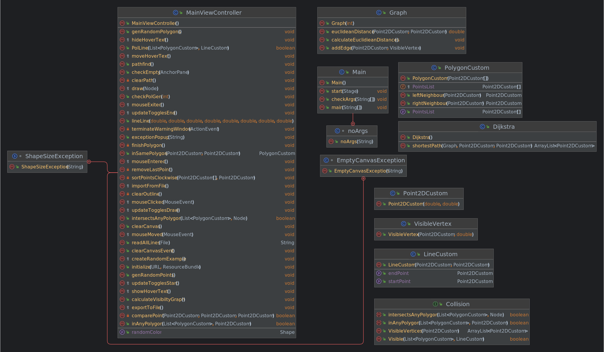

## Pathfinding Project

This is a project for the Computational Geometry course at the West University of Timisoara. The project consists of a pathfinding algorithm that uses the
Dijkstra algorithm to find the shortest path between two points in a graph. Java and JavaFX are used for the implementation.

More Information about the project:

### [Documentation](./docs/Shortest%20Path%20Among%20Obstacles%20Documentation.pdf)
### [Presentation](./docs/Shortest%20Path%20Among%20Obstacles%20Presentation.pptx)
